# 🎣 SOC Lab — Scénario 2 : Détection & Blocage d’une Campagne de Phishing via DNS

> Ce scénario simule une campagne de phishing ciblée contre des utilisateurs du domaine Active Directory `lannister.fr`. L’attaquant utilise Gophish + Zphisher pour voler des identifiants. Wazuh détecte le domaine malveillant via Sysmon et l’API VirusTotal, puis Shuffle bloque automatiquement le domaine sur OPNsense Unbound DNS.
> 

---

## Architecture du Lab


| Composant | Hostname | IP | Rôle |
| --- | --- | --- | --- |
| Pare-feu | CASTERLY-ROCK | 192.168.204.134 | OPNsense — routage, DNS Unbound |
| SIEM | CITY-WATCH | 192.168.30.2 | Wazuh Manager + intégration VirusTotal |
| SOAR | KINGSGUARD | 192.168.30.3 | Shuffle |
| Victime Windows | JAIME | 192.168.10.3 | Client Windows 11 — cible du phishing |
| Attaquant | REDLION | 192.168.204.135 | Kali Linux — Gophish + MailHog |
| Serveur de phishing | AWS (t3.micro) | IP publique | Ubuntu 24.04 — Apache + Zphisher |
| Active Directory | TYWIN | 192.168.20.2 | Windows Server 2022 — `lannister.fr` |

**Flux d’attaque :**

```
[TYWIN / AD]  ──── export users RH ────►  [REDLION / Gophish]
                                                    │
                                         Email phishing AfterWork
                                                    │
                                                    ▼
                                            [JAIME / victime]
                                                    │
                                     Clic sur lien → sharepoint.webhop.me
                                                    │
                                                    ▼
                                         [AWS / Zphisher] ← identifiants volés

[JAIME]  ──── DNS query (Sysmon ID 22) ────►  [CITY-WATCH / Wazuh]
                                                    │
                                         VirusTotal API → malicious
                                                    │
                                                    ▼
                                              [KINGSGUARD / Shuffle]
                                                    │
                                    POST API → OPNsense Unbound DNS
                                                    │
                                    Domaine redirigé vers 0.0.0.0
```

---

## Mise en Place de l’Infrastructure d’Attaque

### REDLION — Gophish (Serveur de Campagne)

Gophish orchestre la campagne de phishing : envoi des emails, tracking des clics, collecte des données.

```bash
sudo mkdir Gophish && cd Gophish
sudo wget https://github.com/gophish/gophish/releases/download/v0.12.1/gophish-v0.12.1-linux-64bit.zip
sudo unzip gophish-v0.12.1-linux-64bit.zip

# Modifier l'écoute admin sur toutes les interfaces / Change admin listen address
sudo nano config.json
# "admin_server": { "listen_url": "0.0.0.0:3333" }

# Créer le service systemd
sudo nano /etc/systemd/system/gophish.service
sudo systemctl daemon-reload
sudo systemctl enable gophish.service
sudo systemctl start gophish.service
```

```
[Unit]
Description=Gophish Phishing Framework
After=network.target

[Service]
ExecStart=/home/arya/Gophish/gophish
WorkingDirectory=/home/arya/Gophish
User=arya
Restart=on-failure
LimitNOFILE=4096

[Install]
WantedBy=multi-user.target
```

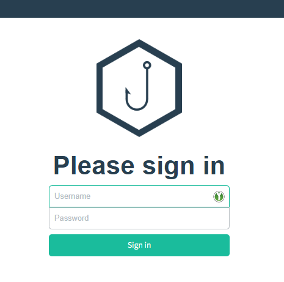

> 💡 Le mot de passe admin initial est affiché dans le terminal au premier lancement.
> 

### REDLION — MailHog (Serveur SMTP de Test)

MailHog intercepte les emails et les affiche dans une interface web. Idéal pour simuler une boîte mail d’entreprise sans infrastructure réelle.

```bash
sudo mkdir Mailhog && cd Mailhog
sudo nano docker-compose.yml
sudo docker compose up -d
```

**Accès / Access :** `http://192.168.204.135:8025`

**Configuration dans Gophish > Sending Profile :**

```
Name           : MailHog REDLION
Interface Type : SMTP
SMTP From      : admin@lannister.fr
Host           : 192.168.204.135:1025
```


- On peut lancer un email de test sur jaime@lannister.fr
    
    
    
- Arrivée de l’email
    
    
    

**Configuration dans Gophish > Email Template :**

```
Name            : Mail AfterWork
Envelope Sender : admin@lannister.fr
Subject         : Invitation AfterWork
Body            : Coller le contenu de afterwork-invitation.html
```

---

### TYWIN — Export des cibles depuis l’AD

BadBlood génère des utilisateurs AD réalistes. Le groupe RH (Ressources Humaines) est la cible de la campagne.

```powershell
# Installation de BadBlood pour peupler l'AD / Install BadBlood to populate AD
git clone https://github.com/davidprowe/badblood.git C:\badblood
.\badblood\invoke-badblood.ps1

# Export du groupe HRE pour Gophish / Export HRE group for Gophish
Get-ADUser -Filter * `
  -SearchBase "OU=HRE,OU=People,DC=lannister,DC=fr" `
  -Properties mail,givenName,sn,title |
  Select-Object `
    @{n='First Name';e={$_.givenName}},
    @{n='Last Name';e={$_.sn}},
    @{n='Email';e={$_.mail}},
    @{n='Position';e={$_.Title}} |
  Export-CSV -Path "C:\UsersGophish.csv" -Delimiter "," -NoTypeInformation
```

- Import du groupe HRE de l’AD dans Gophish > Users & Groups
    
    
    

---

### AWS — Serveur de Phishing Zphisher

Un serveur AWS t3.micro héberge la page de phishing imitant le portail Microsoft SharePoint. Le domaine `sharepoint.webhop.me` est créé gratuitement via No-IP.

```bash
git clone https://github.com/htr-tech/zphisher.git
sudo apt update && sudo apt-get upgrade -y
sudo apt install apache2 -y

# Configurer Apache comme reverse proxy vers Zphisher
sudo nano /etc/apache2/sites-available/sharepoint.conf
sudo a2enmod proxy proxy_http
sudo a2ensite sharepoint.conf
sudo systemctl reload apache2

# Modifier Zphisher pour écouter sur toutes les interfaces
# Dans zphisher.sh :
# HOST='0.0.0.0'
# PORT='8099'

bash zphisher.sh
# Choisir : Option 4 (Microsoft) > localhost > port par défaut
```

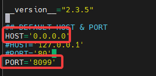

**Modification du fichier loging.html de Anglais → Français & Import dans les sites de Zphisher**

```bash
#Sauvegarde du fichier
cp zphisher/.sites/microsoft/login.html zphisher/.sites/microsoft/login-save.html
#Suppression du fichier
rm zphisher/.sites/microsoft/login.html
#Import de la nouvelle version FR
cp /tmp/login.html zphisher/.sites/microsoft/login.html
```

**Landing Page Gophish (redirection) :**

```html
<!DOCTYPE html>
<html>
<head>
  <title>Chargement en cours...</title>
  <script>
    window.location.replace("http://sharepoint.webhop.me");
  </script>
</head>
<body>
  <p>Redirection vers votre espace SharePoint...</p>
</body>
</html>
```

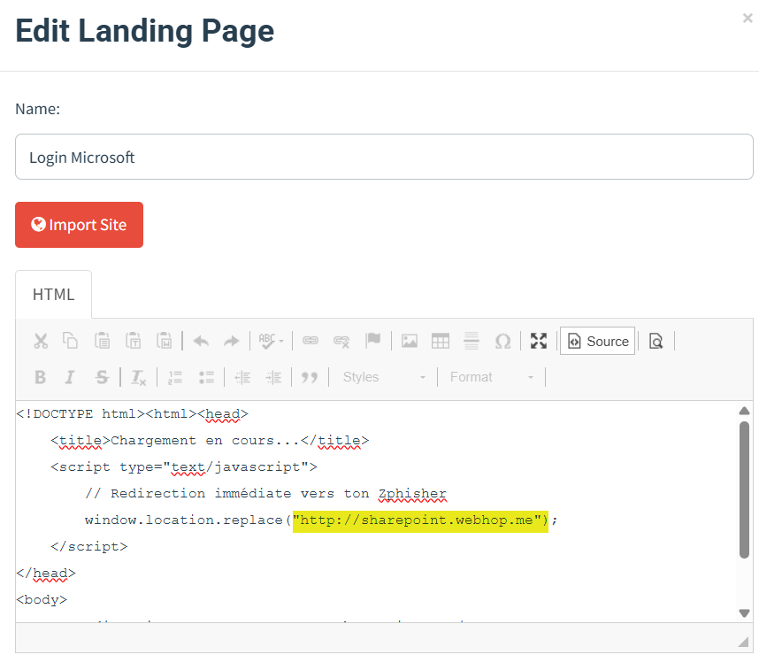

---

## Lancement de la Campagne

**Dans Gophish > Campaigns :**

```
Name           : Campagne Phishing | Lannister.fr
Email Template : Mail AfterWork
Landing Page   : Login Microsoft
URL            : http://192.168.204.135/
Sending Profile: MailHog REDLION
Groups         : Ressources Humaines (HRE)
```

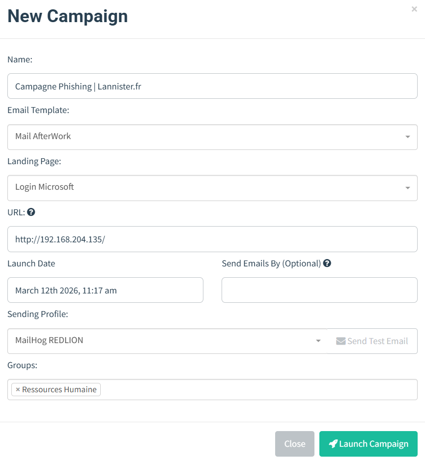

---

## Détection côté SOC

### 1. Sysmon sur JAIME — Capture des requêtes DNS

Sysmon Event ID 22 capture chaque requête DNS émise par Windows. La configuration filtre les domaines internes et les reverse DNS pour ne remonter que les requêtes pertinentes.

**Configuration Sysmon (`sysmonconfig.xml`) :**

```xml
<Sysmon schemaversion="4.90">
  <EventFiltering>

    <NetworkConnect onmatch="include">
      <DestinationPort condition="is">80</DestinationPort>
      <DestinationPort condition="is">443</DestinationPort>
    </NetworkConnect>

    <DnsQuery onmatch="exclude">
      <QueryName condition="end with">.local</QueryName>
      <QueryName condition="end with">.internal</QueryName>
    </DnsQuery>

  </EventFiltering>
</Sysmon>
```

```powershell
# Installation
C:\Sysmon\Sysmon64.exe -i C:\sysmonconfig.xml
# Mise à jour de la config
C:\Sysmon\Sysmon64.exe -c C:\sysmonconfig.xml

# Correctif Edge — forcer le DNS Windows (désactiver le DNS interne Edge)
reg add "HKLM\SOFTWARE\Policies\Microsoft\Edge" /v "BuiltInDnsClientEnabled" /t REG_DWORD /d 0 /f
```

**Configuration agent Wazuh (groupe Windows) :**

```xml
<localfile>
  <location>Microsoft-Windows-Sysmon/Operational</location>
  <log_format>eventchannel</log_format>
  <query>Event/System[EventID=22] or Event/System[EventID=3]</query>
</localfile>
```

---

### 2. Règles Wazuh — Détection DNS & VirusTotal

**Fichier : `/var/ossec/etc/rules/sysmon_url_rules.xml`**

---

### 3. Intégration VirusTotal Custom — Script Python

Le script natif Wazuh VirusTotal ne gère que les hash de fichiers (MD5). Un script custom est nécessaire pour interroger l’API v3 sur les domaines DNS.

**Déploiement :**

```bash
sudo nano /var/ossec/integrations/custom-virustotal-dns.py
sudo nano /var/ossec/integrations/custom-virustotal-dns

#Donner les droits d'execution
sudo chown root:wazuh /var/ossec/integrations/custom-virustotal-dns.py
sudo chown root:wazuh /var/ossec/integrations/custom-virustotal-dns
sudo chmod 750 /var/ossec/integrations/custom-virustotal-dns.py
sudo chmod 750 /var/ossec/integrations/custom-virustotal-dns
```

**Wrapper shell (`/var/ossec/integrations/custom-virustotal-dns`) :**

```bash
#!/bin/sh
WAZUH_PATH="/var/ossec"
${WAZUH_PATH}/framework/python/bin/python3 \
  ${WAZUH_PATH}/integrations/custom-virustotal-dns.py "$@"
```

**Script Python (`/var/ossec/integrations/custom-virustotal-dns.py`) :**

---

### 4. Configuration `ossec.conf` — Wazuh Manager

```xml
<!-- Intégration VirusTotal sur les requêtes DNS -->
<ossec_config>
  <integration>
    <n>custom-virustotal-dns</n>
    <api_key>$VOTRE_CLE_API_VIRUSTOTAL</api_key>
    <rule_id>100200</rule_id>
    <alert_format>json</alert_format>
  </integration>
</ossec_config>

<!-- Envoi vers Shuffle si domaine malveillant confirmé -->
<ossec_config>
  <integration>
    <n>shuffle</n>
    <hook_url>http://192.168.30.3:3001/api/v1/hooks/webhook_[ID]</hook_url>
    <rule_id>100201</rule_id>
    <alert_format>json</alert_format>
  </integration>
</ossec_config>
```

---

## Automatisation du Blocage — Shuffle

Dès que Wazuh déclenche la règle 100201 (domaine malveillant confirmé par VirusTotal), Shuffle reçoit l’alerte et effectue deux appels API vers OPNsense pour bloquer le domaine au niveau DNS.

### Workflow Shuffle — Block Website VirusTotal


Workflow complet ‘Block WebSite VirusTotal’

**Étape 1  — Webhook**
- Reçoit l’alerte JSON de Wazuh
- Variable disponible : `$exec.text.virustotal.domain`

**Étape 2  — AddHostOverride**

```
Method : POST
URL    : https://192.168.204.134/api/unbound/settings/addHostOverride
Auth   : Basic (API Key / Secret OPNsense)
Headers: Content-Type: application/json
Body   :
```

```json
{
  "host": {
    "enabled"    : "1",
    "hostname"   : "*",
    "domain"     : "$exec.text.virustotal.domain",
    "server"     : "0.0.0.0",
    "description": "Wazuh/VT - $exec.timestamp"
  }
}
```

> 💡 Le format `hostname: "*"` + `domain: FQDN_complet` crée un wildcard sur tout le domaine. OPNsense renvoie `0.0.0.0` pour toute requête sur ce domaine.
> 

**Étape 3 — Reconfigure Unbound**

```
Method : POST
URL    : https://192.168.204.134/api/unbound/service/reconfigure
Auth   : Basic (API Key / Secret OPNsense)
Body   : (vide / empty)
```

---

## Déroulement Complet du Scénario / Full Scenario Walkthrough

1. L’attaquant lance Zphisher sur AWS → `sharepoint.webhop.me` pointe vers la page Microsoft falsifiée
    1. Option 4 (Microsoft) en [localhost](http://localhost) (1) sans rechanger le port, la configuration du apache via sharepoint.conf fait pointer le zphisher sur sharepoint.webhop.me
        
        
        
2. Gophish envoie les emails « Invitation AfterWork » via MailHog aux membres du groupe HRE
    
    
    
3. JAIME reçoit l’email dans MailHog et clique sur le lien d’inscription
    
    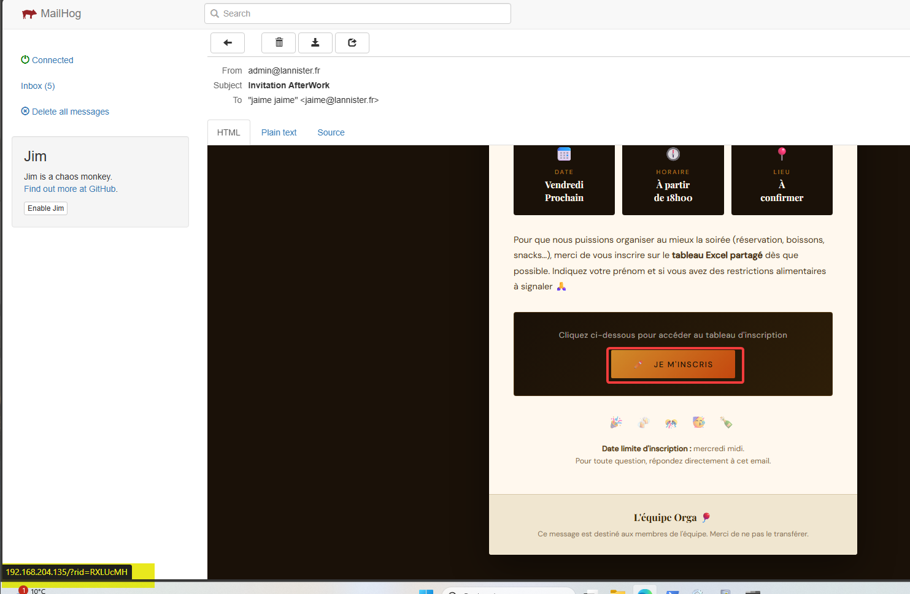
    
4. JAIME saisit ses identifiants sur la page de phishing SharePoint
    
    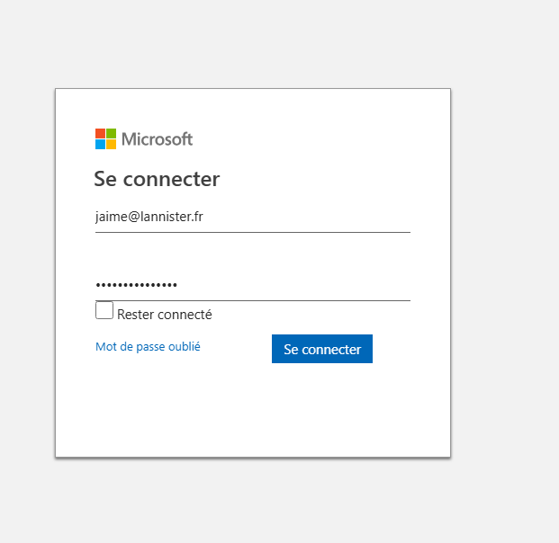
    
5. L’attaquant reçoit les identifiants en clair dans son terminal Zphisher
    
    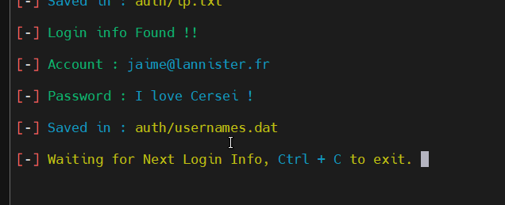
    
6. JAIME est redirigé vers la vraie page de récupération de compte Microsoft
    
    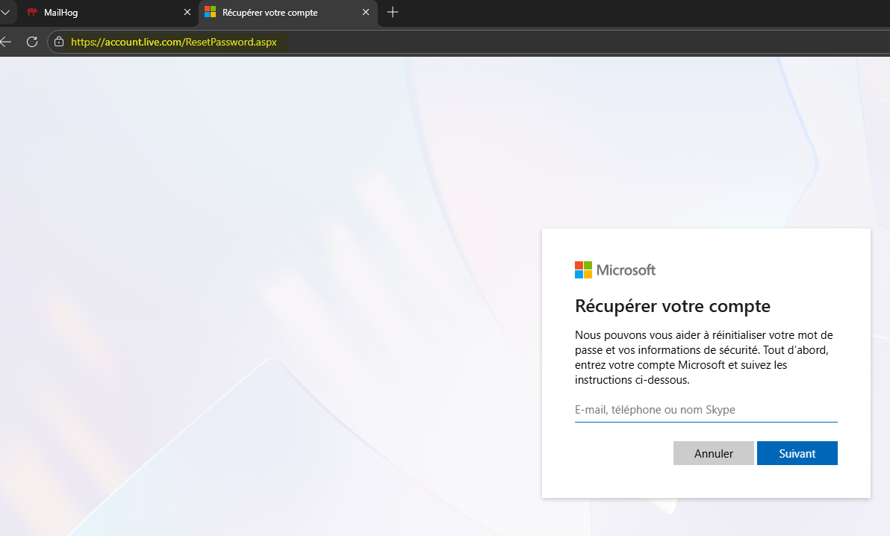
    
7. Sysmon Event ID 22 a capturé la requête DNS vers `sharepoint.webhop.me` et la remonte à Wazuh
    
    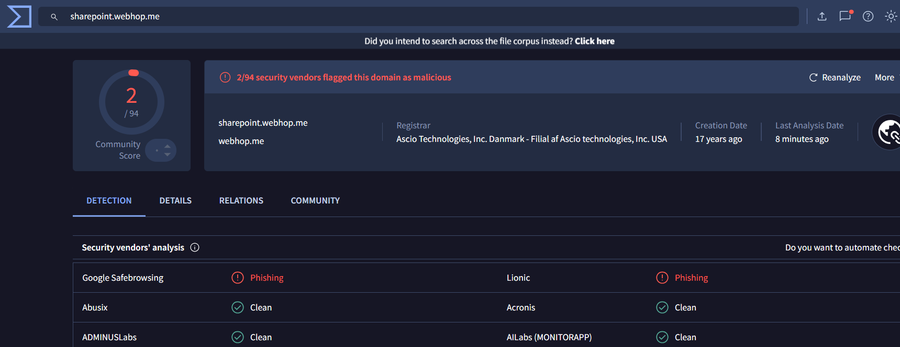
    
8. L’intégration VirusTotal confirme que le domaine est malveillant → règle 100201 (level 12)
    
    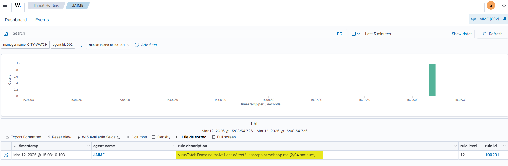
    
9. Shuffle reçoit l’alerte et bloque `sharepoint.webhop.me` sur OPNsense Unbound DNS → redirigé vers `0.0.0.0`
    
    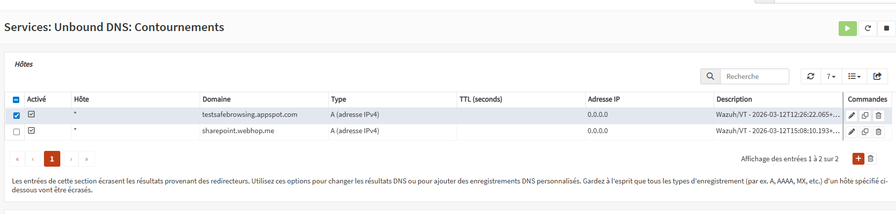
    
10. Plus aucun poste du réseau ne peut résoudre le domaine malveillant
    
    
    

---

## Résultat

Le domaine malveillant est détecté et bloqué en moins d’une minute après le premier clic de la victime. L’ensemble de la chaîne est automatisée : Sysmon → Wazuh → VirusTotal → Shuffle → OPNsense. Aucune intervention manuelle n’est nécessaire.

---

## Stack Technique

| Outil / Tool | Version | Rôle / Role |
| --- | --- | --- |
| OPNsense | 24.x | Pare-feu, DNS Unbound, API blocage |
| Wazuh | 4.14.3 | SIEM, corrélation, intégrations |
| Sysmon | v15.15 | Télémétrie DNS Windows (Event ID 22) |
| VirusTotal API | v3 | Réputation de domaine |
| Shuffle | latest | SOAR, orchestration |
| Gophish | v0.12.1 | Plateforme de campagne phishing |
| Zphisher | latest | Clonage de page de connexion |
| MailHog | latest | Serveur SMTP de test |
| BadBlood | latest | Population AD réaliste |

---

## 🔗 Références

- [Wazuh Documentation](https://documentation.wazuh.com/)
- [VirusTotal API v3](https://developers.virustotal.com/reference/overview)
- [OPNsense Unbound API](https://docs.opnsense.org/development/api/core/unbound.html)
- [Gophish Documentation](https://docs.getgophish.com/)
- [Zphisher GitHub](https://github.com/htr-tech/zphisher)
- [Sysmon — Microsoft Sysinternals](https://learn.microsoft.com/sysinternals/downloads/sysmon)
- [BadBlood — AD Population](https://github.com/davidprowe/badblood)